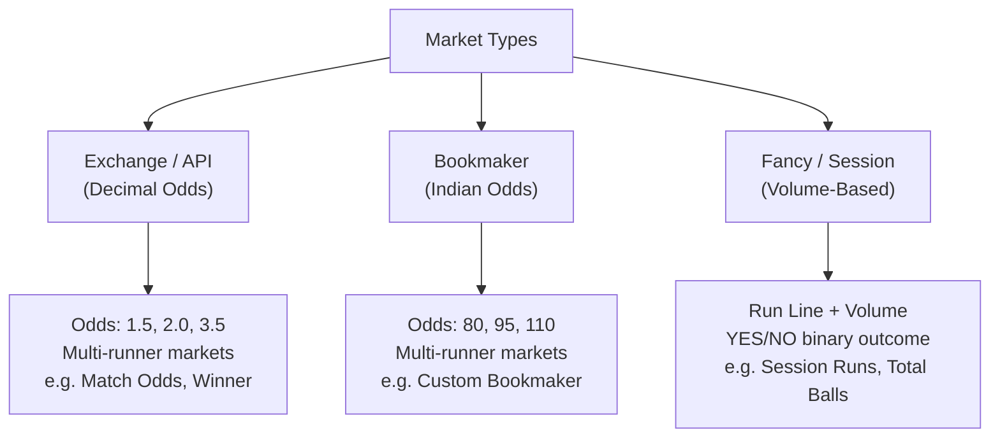
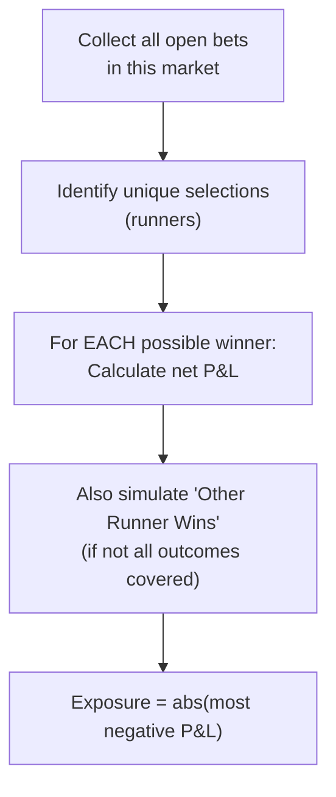
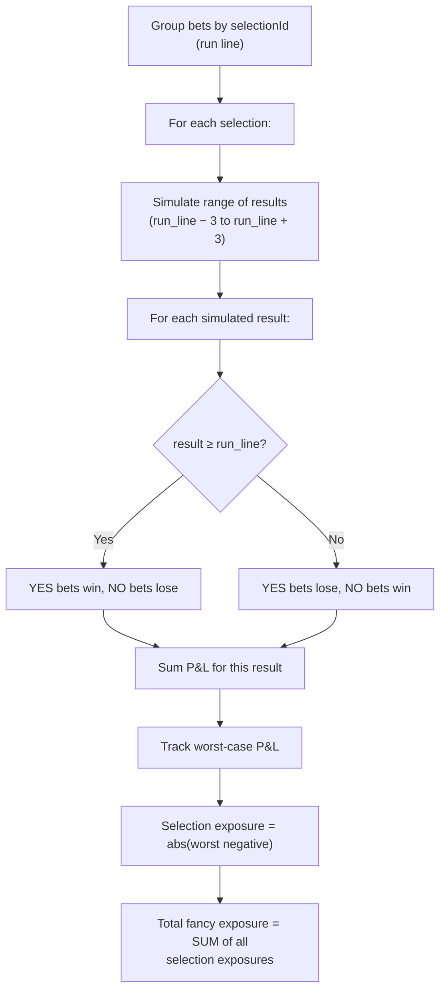
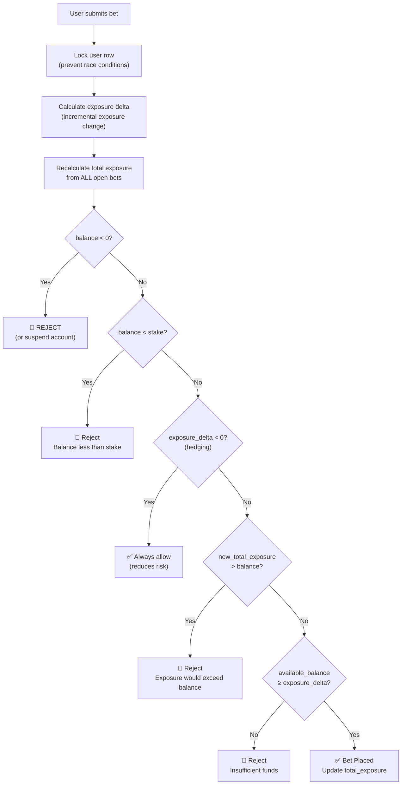
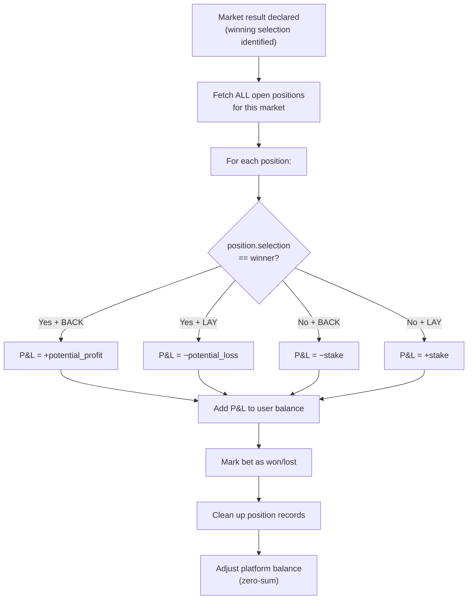

# Betting Exchange — Exposure & P&L Calculation Guide

> **Audience**: Junior developers working on a betting exchange platform  
> **Purpose**: Complete reference for understanding how exposure, profit & loss, and settlement work across all market types

---

## Table of Contents

1. [Core Concepts](#1-core-concepts)
2. [The Three Market Types](#2-the-three-market-types)
3. [Exchange Markets — Decimal Odds](#3-exchange-markets--decimal-odds)
4. [Bookmaker Markets — Indian Odds](#4-bookmaker-markets--indian-odds)
5. [Fancy / Session Markets — Volume-Based Odds](#5-fancy--session-markets--volume-based-odds)
6. [Real-World Multi-Bet Scenarios](#6-real-world-multi-bet-scenarios)
7. [Market-Wide Exposure Calculation](#7-market-wide-exposure-calculation)
8. [Balance & Wallet Integration](#8-balance--wallet-integration)
9. [Settlement Engine](#9-settlement-engine)
10. [Quick Reference Cheat Sheet](#10-quick-reference-cheat-sheet)

---

## 1. Core Concepts

Before diving into formulas, understand these five terms — they are used everywhere:

| Term | Definition |
|------|-----------|
| **Stake** | The amount of money the user puts on a bet |
| **Odds** | The price/multiplier that determines profit or liability |
| **Exposure** | The **worst-case loss** a user faces across all their open bets in a market. This is the amount "locked" from their available balance |
| **P&L (Profit & Loss)** | The actual gain or loss when a bet settles (positive = profit, negative = loss) |
| **Available Balance** | `balance − total_exposure` — what the user can still bet with |

> [!IMPORTANT]
> **Exposure ≠ Stake.** For BACK bets, exposure equals the stake. For LAY bets, exposure equals the **liability** (which depends on odds). This distinction is critical and is the #1 source of bugs.

### BACK vs LAY

These are the two fundamental bet types in any exchange:

```
BACK = "I think this selection WILL win"    → You risk your stake, you profit based on odds
LAY  = "I think this selection WON'T win"   → You act as the bookmaker, accepting someone's bet
```

| | BACK | LAY |
|---|---|---|
| **If selection wins** | You **profit** | You **pay** (liability) |
| **If selection loses** | You **lose** stake | You **win** stake |

> [!NOTE]
> Think of BACK as the punter, and LAY as the bookie. Every bet on an exchange has a BACK side and a LAY side — the exchange just matches them together.

---

## 2. The Three Market Types

A typical betting exchange platform supports three distinct market categories, each with its own odds format and calculation rules:



| Market Type | Odds Format | Example Odds | How to Read |
|-------------|------------|--------------|-------------|
| **Exchange** | Decimal | `2.50` | "Returns 2.5× your stake" (profit = 1.5× stake) |
| **Bookmaker** | Indian (percentage) | `85` | "Profit = 85% of your stake" |
| **Fancy** | Run Line + Volume | `38.5 / 90` | "If score ≥ 38.5, profit = 90% of stake" |

---

## 3. Exchange Markets — Decimal Odds

These are standard Betfair-style markets with decimal odds (e.g., `2.50` means "2.5 times your stake returned").

### 3.1 Exposure Formulas

| Bet Type | Formula | Intuition |
|----------|---------|-----------|
| **BACK** | `exposure = stake` | You can only lose what you put in |
| **LAY** | `exposure = stake × (odds − 1)` | You risk the liability — the payout you owe if selection wins |

### 3.2 P&L Formulas

| Bet Type | Outcome | Formula | Sign |
|----------|---------|---------|------|
| BACK | **Wins** | `+stake × (odds − 1)` | ✅ Profit |
| BACK | **Loses** | `−stake` | ❌ Loss |
| LAY | **Selection loses** (you win) | `+stake` | ✅ Profit |
| LAY | **Selection wins** (you lose) | `−stake × (odds − 1)` | ❌ Loss |

### 3.3 Worked Example — BACK Bet

> **Scenario**: User backs "India" at odds **2.50** with a stake of **₹10,000**

```
Exposure (locked from balance):
  = stake
  = ₹10,000

If India WINS:
  Profit = stake × (odds − 1)
         = ₹10,000 × (2.50 − 1)
         = ₹10,000 × 1.50
         = +₹15,000   ✅

If India LOSES:
  Loss = −stake
       = −₹10,000   ❌
```

### 3.4 Worked Example — LAY Bet

> **Scenario**: User lays "Australia" at odds **3.00** with a stake of **₹5,000**

```
Exposure (locked from balance):
  = stake × (odds − 1)
  = ₹5,000 × (3.00 − 1)
  = ₹5,000 × 2.00
  = ₹10,000

If Australia LOSES (you win):
  Profit = +stake
         = +₹5,000   ✅

If Australia WINS (you lose):
  Loss = −stake × (odds − 1)
       = −₹5,000 × 2.00
       = −₹10,000   ❌
```

> [!TIP]
> **Mental model for LAY**: You're the bookmaker. If the selection wins, you pay the bettor their winnings (that's your liability). If it loses, you keep their stake.

### 3.5 Why `(odds − 1)`?

Decimal odds include the stake in the return. If odds are `3.00`:
- Total return = `stake × 3.00` = ₹15,000
- But ₹5,000 is your own stake being returned
- Net profit = ₹15,000 − ₹5,000 = ₹10,000 = `stake × (3.00 − 1)`

This is why we always subtract 1 from decimal odds for P&L calculations.

---

## 4. Bookmaker Markets — Indian Odds

Custom bookmaker markets use **Indian odds** (percentage-based). An odds value of `85` means "85% of your stake as profit."

### 4.1 Converting the Mental Model

| Decimal Odds | Equivalent Indian Odds | Meaning |
|-------------|----------------------|---------|
| 1.85 | 85 | Profit = 85% of stake |
| 2.00 | 100 | Profit = 100% of stake (even money) |
| 1.50 | 50 | Profit = 50% of stake |

**Conversion**: `Indian Odds = (Decimal Odds − 1) × 100`

### 4.2 Exposure Formulas

| Bet Type | Formula | Intuition |
|----------|---------|-----------|
| **BACK** | `exposure = stake` | You risk your stake |
| **LAY** | `exposure = (stake × odds) / 100` | Liability as a percentage of stake |

### 4.3 P&L Formulas

| Bet Type | Outcome | Formula | Sign |
|----------|---------|---------|------|
| BACK | **Wins** | `+(stake × odds) / 100` | ✅ Profit |
| BACK | **Loses** | `−stake` | ❌ Loss |
| LAY | **Selection loses** (you win) | `+stake` | ✅ Profit |
| LAY | **Selection wins** (you lose) | `−(stake × odds) / 100` | ❌ Loss |

### 4.4 Worked Example — BACK Bet

> **Scenario**: User backs "CSK" in a bookmaker market at odds **85** with ₹20,000 stake

```
Exposure:
  = stake
  = ₹20,000

If CSK WINS:
  Profit = (stake × odds) / 100
         = (₹20,000 × 85) / 100
         = +₹17,000   ✅

If CSK LOSES:
  Loss = −stake
       = −₹20,000   ❌
```

### 4.5 Worked Example — LAY Bet

> **Scenario**: User lays "MI" at odds **95** with ₹10,000 stake

```
Exposure:
  = (stake × odds) / 100
  = (₹10,000 × 95) / 100
  = ₹9,500

If MI LOSES (you win):
  Profit = +stake
         = +₹10,000   ✅

If MI WINS (you lose):
  Loss = −(stake × odds) / 100
       = −₹9,500   ❌
```

---

## 5. Fancy / Session Markets — Volume-Based Odds

Fancy markets are **fundamentally different** from exchange and bookmaker markets. They are binary YES/NO bets on a **run line threshold**.

### 5.1 Two Numbers, Not One

Every fancy bet has **two** critical numbers:

| Number | Also Called | What It Means |
|--------|-----------|---------------|
| **Odds** | Run Line, Threshold | The score/runs boundary (e.g., 38.5) |
| **Volume** | Multiplier, Rate | The profit percentage if you win (e.g., 90 = 90%) |

```
In the UI:       38.5 / 90
                  ↑       ↑
              Run Line  Volume (profit multiplier)
```

### 5.2 YES = BACK, NO = LAY

| Code Term | User-Facing Term | Meaning |
|-----------|-----------------|---------|
| `BACK` | **YES** | "I think the result will be **≥** the run line" |
| `LAY` | **NO** | "I think the result will be **<** the run line" |

### 5.3 Exposure Formulas

| Bet Type | Formula | Intuition |
|----------|---------|-----------|
| **YES (BACK)** | `exposure = stake` | You risk your stake |
| **NO (LAY)** | `exposure = (stake × volume) / 100` | Liability based on multiplier |

### 5.4 P&L Formulas

| Bet Type | Outcome | Formula | Sign |
|----------|---------|---------|------|
| YES (BACK) | Result **≥** run line → wins | `+(stake × volume) / 100` | ✅ Profit |
| YES (BACK) | Result **<** run line → loses | `−stake` | ❌ Loss |
| NO (LAY) | Result **<** run line → wins | `+stake` | ✅ Profit |
| NO (LAY) | Result **≥** run line → loses | `−(stake × volume) / 100` | ❌ Loss |

### 5.5 Worked Example — YES Bet

> **Scenario**: User bets YES on "India Over 38.5" at volume **90** with ₹5,000 stake

```
Exposure:
  = stake
  = ₹5,000

If actual score is 42 (≥ 38.5 → YES wins):
  Profit = (stake × volume) / 100
         = (₹5,000 × 90) / 100
         = +₹4,500   ✅

If actual score is 35 (< 38.5 → YES loses):
  Loss = −stake
       = −₹5,000   ❌
```

### 5.6 Worked Example — NO Bet

> **Scenario**: User bets NO on "Over 42.5" at volume **120** with ₹8,000 stake

```
Exposure:
  = (stake × volume) / 100
  = (₹8,000 × 120) / 100
  = ₹9,600

If actual score is 39 (< 42.5 → NO wins):
  Profit = +stake
         = +₹8,000   ✅

If actual score is 45 (≥ 42.5 → NO loses):
  Loss = −(stake × volume) / 100
       = −₹9,600   ❌
```

> [!WARNING]
> **NO bets with high volume can have exposure GREATER than stake!** In the example above, the user stakes ₹8,000 but their exposure is ₹9,600. This is a common source of confusion — always use the formula, never assume exposure equals stake.

---

## 6. Real-World Multi-Bet Scenarios

This section covers **every practical combination** of BACK and LAY bets you'll encounter in production. Each example shows the outcome simulation step by step.

> [!IMPORTANT]
> This is the most important section of this document. Individual bet math is simple — the complexity comes from how bets **interact** within a market.

### Scenario A: BACK on Two Different Runners (Exchange)

> User backs **India** @ 2.50 for ₹10,000 AND backs **Australia** @ 3.00 for ₹5,000

**If India wins:**
```
BACK India (wins):      +₹10,000 × (2.50 − 1) = +₹15,000
BACK Australia (loses): −₹5,000
Net P&L = +₹10,000
```

**If Australia wins:**
```
BACK India (loses):       −₹10,000
BACK Australia (wins):    +₹5,000 × (3.00 − 1) = +₹10,000
Net P&L = ₹0
```

**If Draw / Other wins (neither India nor Australia):**
```
BACK India (loses):       −₹10,000
BACK Australia (loses):   −₹5,000
Net P&L = −₹15,000
```

**Worst case** = −₹15,000 → **Exposure = ₹15,000**

> [!TIP]
> When you BACK multiple runners, the "other runner wins" scenario is the worst case because ALL your bets lose. The exposure equals the sum of all stakes.

---

### Scenario B: LAY on Two Different Runners (Exchange)

> User lays **India** @ 2.00 for ₹8,000 AND lays **Australia** @ 3.50 for ₹4,000

**If India wins:**
```
LAY India (loses):     −₹8,000 × (2.00 − 1)  = −₹8,000
LAY Australia (wins):  +₹4,000
Net P&L = −₹4,000
```

**If Australia wins:**
```
LAY India (wins):       +₹8,000
LAY Australia (loses):  −₹4,000 × (3.50 − 1) = −₹10,000
Net P&L = −₹2,000
```

**If Draw / Other wins:**
```
LAY India (wins):       +₹8,000
LAY Australia (wins):   +₹4,000
Net P&L = +₹12,000   ✅ (profit in all "other" scenarios!)
```

**Worst case** = MIN(−₹4,000, −₹2,000, +₹12,000) = −₹4,000 → **Exposure = ₹4,000**

> [!NOTE]
> When you LAY multiple runners, the worst case is when one of them wins (and you owe that liability). The "other runner wins" scenario is actually your BEST case — you win all stakes.

---

### Scenario C: BACK One Runner, LAY a Different Runner (Exchange)

> User backs **India** @ 2.00 for ₹10,000 AND lays **Australia** @ 2.50 for ₹6,000  
> (This is NOT hedging — the bets are on different selections)

**If India wins:**
```
BACK India (wins):      +₹10,000 × (2.00 − 1) = +₹10,000
LAY Australia (wins):   +₹6,000
Net P&L = +₹16,000
```

**If Australia wins:**
```
BACK India (loses):     −₹10,000
LAY Australia (loses):  −₹6,000 × (2.50 − 1) = −₹9,000
Net P&L = −₹19,000
```

**If Draw / Other wins:**
```
BACK India (loses):     −₹10,000
LAY Australia (wins):   +₹6,000
Net P&L = −₹4,000
```

**Worst case** = −₹19,000 → **Exposure = ₹19,000**

> [!WARNING]
> BACK + LAY on **different** selections is the highest-risk combination. If the selection you LAY wins, you lose BOTH the BACK stake AND the LAY liability. Always validate this carefully.

---

### Scenario D: BACK and LAY on the SAME Runner — Hedging (Exchange)

> User backs **India** @ 1.80 for ₹20,000 AND then lays **India** @ 2.10 for ₹20,000

**If India wins:**
```
BACK India (wins):  +₹20,000 × (1.80 − 1) = +₹16,000
LAY India (loses):  −₹20,000 × (2.10 − 1) = −₹22,000
Net P&L = −₹6,000
```

**If India loses / Other wins:**
```
BACK India (loses): −₹20,000
LAY India (wins):   +₹20,000
Net P&L = ₹0
```

**Worst case** = −₹6,000 → **Exposure = ₹6,000**

Compare with naïve sum: ₹20,000 (BACK) + ₹22,000 (LAY) = ₹42,000. The actual exposure is only ₹6,000 because the bets offset.

> What if the user had gotten **better odds on the LAY**? Say LAY @ 1.60:

**If India wins:**
```
BACK India (wins):  +₹20,000 × (1.80 − 1) = +₹16,000
LAY India (loses):  −₹20,000 × (1.60 − 1) = −₹12,000
Net P&L = +₹4,000   ✅
```

**If India loses:**
```
BACK (loses): −₹20,000
LAY (wins):   +₹20,000
Net P&L = ₹0
```

**Worst case** = ₹0 → **Exposure = ₹0** 🎉

This is a **risk-free position** (guaranteed profit or break-even). The user has successfully arbitraged.

---

### Scenario E: Three-Way Market with Draw (Exchange)

> Football match: User backs **Home** @ 2.20 for ₹10,000, backs **Draw** @ 3.50 for ₹5,000

**If Home wins:**
```
BACK Home (wins):   +₹10,000 × 1.20 = +₹12,000
BACK Draw (loses):  −₹5,000
Net P&L = +₹7,000
```

**If Draw:**
```
BACK Home (loses):  −₹10,000
BACK Draw (wins):   +₹5,000 × 2.50 = +₹12,500
Net P&L = +₹2,500
```

**If Away wins (other):**
```
BACK Home (loses):  −₹10,000
BACK Draw (loses):  −₹5,000
Net P&L = −₹15,000
```

**Worst case** = −₹15,000 → **Exposure = ₹15,000**

> Now, if the user ALSO backs **Away** @ 4.00 for ₹4,000 (covering all 3 outcomes):

**If Away wins:**
```
BACK Home (loses):  −₹10,000
BACK Draw (loses):  −₹5,000
BACK Away (wins):   +₹4,000 × 3.00 = +₹12,000
Net P&L = −₹3,000
```

**Worst case** now = MIN(+₹7,000, +₹2,500, −₹3,000) = −₹3,000 → **Exposure = ₹3,000**

The "other runner wins" scenario is **skipped** because the system detects all 3 outcomes are covered (3 selections including "Draw").

---

### Scenario F: Same Runner, Multiple Bets at Different Odds (Exchange)

> User backs **India** three times as odds shift:
> - BACK ₹5,000 @ 1.80
> - BACK ₹3,000 @ 2.00
> - BACK ₹2,000 @ 2.30

**If India wins:**
```
Bet 1: +₹5,000 × 0.80 = +₹4,000
Bet 2: +₹3,000 × 1.00 = +₹3,000
Bet 3: +₹2,000 × 1.30 = +₹2,600
Net P&L = +₹9,600
```

**If India loses / Other wins:**
```
Bet 1: −₹5,000
Bet 2: −₹3,000
Bet 3: −₹2,000
Net P&L = −₹10,000
```

**Worst case** = −₹10,000 → **Exposure = ₹10,000** (= total stakes, as expected for all BACK)

---

### Scenario G: Bookmaker — BACK and LAY on Same Runner (Indian Odds)

> User backs **Team A** @ odds 90 for ₹15,000 AND lays **Team A** @ odds 75 for ₹15,000

**If Team A wins:**
```
BACK (wins):  +(₹15,000 × 90) / 100  = +₹13,500
LAY (loses):  −(₹15,000 × 75) / 100  = −₹11,250
Net P&L = +₹2,250   ✅
```

**If Team A loses:**
```
BACK (loses): −₹15,000
LAY (wins):   +₹15,000
Net P&L = ₹0
```

**Worst case** = ₹0 → **Exposure = ₹0** 🎉

This is a **guaranteed profit** position. The user backed at higher odds and laid at lower odds.

---

### Scenario H: Fancy — YES and NO on Different Run Lines

> User has bets on two DIFFERENT fancy selections (different run lines):
> - YES on "Over 35.5" @ volume 80 for ₹10,000
> - NO on "Over 42.5" @ volume 100 for ₹6,000

These are **independent** — calculated separately then summed:

**Selection 1: "Over 35.5"**
```
If result ≥ 35.5 (YES wins): +(₹10,000 × 80)/100  = +₹8,000
If result < 35.5 (YES loses): −₹10,000
Worst case = −₹10,000 → Exposure₁ = ₹10,000
```

**Selection 2: "Over 42.5"**
```
If result < 42.5 (NO wins):  +₹6,000
If result ≥ 42.5 (NO loses): −(₹6,000 × 100)/100 = −₹6,000
Worst case = −₹6,000 → Exposure₂ = ₹6,000
```

**Total Fancy Exposure = ₹10,000 + ₹6,000 = ₹16,000**

> [!IMPORTANT]
> Even though both bets could WIN simultaneously (e.g., if score is 40 — over 35.5 YES wins, under 42.5 NO wins), we do NOT net them. Fancy selections are always independent. This is a fundamental design rule.

---

### Scenario Summary Table

| Scenario | Bets | Worst Case | Key Insight |
|----------|------|-----------|-------------|
| **A** BACK + BACK (diff runners) | Back India + Back Aus | Sum of all stakes | "Other wins" = all lose |
| **B** LAY + LAY (diff runners) | Lay India + Lay Aus | Largest single liability | "Other wins" = all win (best case!) |
| **C** BACK + LAY (diff runners) | Back India + Lay Aus | Stake + liability of loser | Highest risk combination |
| **D** BACK + LAY (same runner) | Back + Lay India | Depends on odds gap | **Hedging** — can be risk-free |
| **E** 3-way with Draw | Back Home + Draw + Away | Varies | Skip "other" when all covered |
| **F** Multiple BACK same runner | 3× Back India | Sum of stakes | Same as single BACK (additive) |
| **G** Bookmaker hedge | Back + Lay same (Indian) | Can be ₹0 | Guaranteed profit possible |
| **H** Fancy diff selections | YES line1 + NO line2 | Sum independently | Never net across selections |

---

## 7. Market-Wide Exposure Calculation

Individual bet exposure is straightforward, but **market-wide exposure** is more complex because multiple bets in the same market can **hedge** (offset) each other.

### 7.1 Exchange & Bookmaker: Outcome-Based Simulation

The correct way to calculate market exposure is to simulate **every possible outcome** and find the **worst case**:



#### The Algorithm

```
worst_case = 0

FOR each possible winning selection:
    net_pnl = 0

    FOR each bet in this market:
        IF bet.selection == winning_selection:
            // This bet's selection WINS
            BACK → net_pnl += profit formula
            LAY  → net_pnl -= liability formula
        ELSE:
            // This bet's selection LOSES
            BACK → net_pnl -= stake
            LAY  → net_pnl += stake

    worst_case = MIN(worst_case, net_pnl)

// Also simulate "other runner wins" if user hasn't bet on all runners
IF not all outcomes covered:
    net_pnl = 0
    FOR each bet:
        BACK → net_pnl -= stake    (all BACK bets lose)
        LAY  → net_pnl += stake    (all LAY bets win)
    worst_case = MIN(worst_case, net_pnl)

exposure = abs(MIN(0, worst_case))
```

> [!NOTE]
> If `worst_case` is positive or zero (the user profits or breaks even in every scenario), exposure is **₹0** — the user has a risk-free position.

#### Worked Example — Hedging Reduces Exposure

> **Scenario**: User has TWO bets on the same Match Odds market:
> 1. BACK India @ 2.00 for ₹10,000
> 2. LAY India @ 2.20 for ₹10,000

**Naïve approach** (summing individual exposures):
```
BACK exposure: ₹10,000
LAY exposure:  ₹10,000 × (2.20 − 1) = ₹12,000
Naïve total:   ₹22,000   ← WRONG!
```

**Correct approach** (outcome simulation):

**Simulate "India Wins":**
```
Bet 1 (BACK India, wins): +₹10,000 × (2.00 − 1) = +₹10,000
Bet 2 (LAY India, loses):  −₹10,000 × (2.20 − 1) = −₹12,000
Net P&L = +₹10,000 − ₹12,000 = −₹2,000
```

**Simulate "Other Team Wins":**
```
Bet 1 (BACK India, loses): −₹10,000
Bet 2 (LAY India, wins):   +₹10,000
Net P&L = −₹10,000 + ₹10,000 = ₹0
```

**Worst case** = MIN(−₹2,000, ₹0) = **−₹2,000**  
**Actual Market Exposure** = **₹2,000**

> [!TIP]
> The outcome simulation correctly identifies that the actual risk is only ₹2,000 — not ₹22,000. This is why you must **never** simply sum individual bet exposures. Always simulate every possible outcome.

### 7.2 The "Other Runner Wins" Scenario

For markets where the user hasn't bet on **every** possible runner, you must also simulate what happens if **none** of the user's selections win:

```
If "Other runner wins":
    ALL BACK bets lose their stake
    ALL LAY bets win their stake
```

**When to skip this scenario** (all outcomes already covered):
- 3+ selections including "Draw" → classic 3-way football market
- User has bet on every runner in the market (match selection count to market's runner count)
- 2-way markets like tennis (only 2 possible outcomes, no draw)

### 7.3 Fancy Markets: Independent Per-Selection Simulation

> [!IMPORTANT]
> Unlike exchange markets, fancy bets on **different selections are completely independent** — they never net off against each other. Each fancy selection's exposure is calculated separately, then summed.



#### Why Simulate a Range?

When a user has both YES and NO bets on the same run line at different odds/volumes, the P&L varies depending on the actual result. Simulating a range (typically ±3 around the run lines) finds the true worst case.

#### Worked Example — Multiple Fancy Bets on Same Selection

> **Bets on "India Over 38.5":**
> - YES ₹5,000 @ volume 90
> - NO ₹3,000 @ volume 80

**Simulate result = 42 (≥ 38.5 → YES wins, NO loses):**
```
YES wins: +(₹5,000 × 90) / 100 = +₹4,500
NO loses: −(₹3,000 × 80) / 100 = −₹2,400
Net = +₹2,100
```

**Simulate result = 35 (< 38.5 → YES loses, NO wins):**
```
YES loses: −₹5,000
NO wins:   +₹3,000
Net = −₹2,000
```

**Worst case** = −₹2,000 → **Selection Exposure = ₹2,000**

---

## 8. Balance & Wallet Integration

### 8.1 The Core Balance Equation

```
Available Balance = Balance − Total Exposure
```

Where `Total Exposure` = sum of worst-case losses across **all** open markets (exchange + bookmaker + fancy).

### 8.2 Pre-Bet Validation Flow

When a user attempts to place a bet, the system must validate they have sufficient funds:



### 8.3 Exposure Delta (Incremental Calculation)

Instead of recalculating the entire portfolio every time, use the **delta approach**:

```
exposure_delta = exposure_with_new_bet − exposure_without_new_bet
```

This is calculated at the **market level** only (not the entire portfolio), which is much faster.

**Key insight**: When a new bet hedges existing positions, the delta can be **negative** — meaning the bet actually **frees up** balance. These bets should always be allowed regardless of available balance.

### 8.4 Risk Status Classification

```
exposure_percentage = (total_exposure / balance) × 100

SAFE    → exposure_percentage < 40%    🟢
WARNING → exposure_percentage 40–70%   🟡
DANGER  → exposure_percentage > 70%    🔴
```

### 8.5 Race Condition Prevention

> [!CAUTION]
> Two simultaneous bet requests can both pass validation before either updates the exposure. **Always lock the user row** (e.g., `SELECT ... FOR UPDATE`) within a database transaction before calculating exposure. This serializes concurrent bet placements for the same user.

---

## 9. Settlement Engine

When a market result is declared, the settlement engine processes all open bets and adjusts balances.

### 9.1 Exchange & Bookmaker Settlement



#### Settlement P&L Formulas (Exchange — Decimal)

| Selection Matched Winner? | BACK P&L | LAY P&L |
|--------------------------|----------|---------|
| **Yes** | `+potential_profit` (stored on bet) | `−potential_loss` (stored on bet) |
| **No** | `−stake` | `+stake` |

#### Settlement P&L Formulas (Bookmaker — Indian)

Same logic, but profit/loss values use `(stake × odds) / 100` instead of `stake × (odds − 1)`.

### 9.2 Fancy Settlement

Fancy markets settle when a result value is compared against the run line:

```
If result ≥ run_line → outcome is "YES"
If result < run_line → outcome is "NO"
```

| Outcome | YES (BACK) Bet P&L | NO (LAY) Bet P&L |
|---------|-------------------|-----------------|
| **YES** (result ≥ line) | `+(stake × volume) / 100` | `−(stake × volume) / 100` |
| **NO** (result < line) | `−stake` | `+stake` |

### 9.3 The Zero-Sum Principle

The platform (house) is always the counterparty. Every rupee a user wins comes from the platform; every rupee a user loses goes to the platform:

```
platform_balance_change = −SUM(all user P&Ls for this market)
```

| Users Collectively | Platform Impact |
|-------------------|-----------------|
| Won ₹50,000 | Platform loses ₹50,000 |
| Lost ₹30,000 | Platform gains ₹30,000 |

### 9.4 Post-Settlement Cleanup

After settlement:
1. All bet records are updated with `status: 'won' | 'lost' | 'void'` and `realized_pnl`
2. Position tracking records are deleted (no longer needed)
3. User's `total_exposure` is recalculated from remaining open bets
4. Available balance increases by the released exposure ± P&L

### 9.5 Void Markets

When a market is voided (cancelled), all bets get `P&L = 0`:
- No money changes hands
- All exposure is released
- Bets are marked as `'void'`

---

## 10. Quick Reference Cheat Sheet

### Exposure at a Glance

| Market Type | BACK Exposure | LAY Exposure |
|-------------|--------------|--------------|
| **Exchange** (Decimal) | `stake` | `stake × (odds − 1)` |
| **Bookmaker** (Indian) | `stake` | `(stake × odds) / 100` |
| **Fancy** (Session) | `stake` | `(stake × volume) / 100` |

### P&L at a Glance — WIN

| Market Type | BACK Profit | LAY Profit |
|-------------|------------|------------|
| **Exchange** | `stake × (odds − 1)` | `stake` |
| **Bookmaker** | `(stake × odds) / 100` | `stake` |
| **Fancy** | `(stake × volume) / 100` | `stake` |

### P&L at a Glance — LOSE

| Market Type | BACK Loss | LAY Loss |
|-------------|-----------|----------|
| **Exchange** | `−stake` | `−stake × (odds − 1)` |
| **Bookmaker** | `−stake` | `−(stake × odds) / 100` |
| **Fancy** | `−stake` | `−(stake × volume) / 100` |

### Market Exposure Algorithm Summary

| Market Type | Algorithm |
|-------------|-----------|
| **Exchange / Bookmaker** | Simulate all possible winning outcomes → take worst-case net P&L across all scenarios |
| **Fancy** | Group by selection → simulate run range (±3 around line) per selection → sum worst-cases independently |

### Key Rules to Remember

1. **BACK exposure = always the stake** (across all market types)
2. **LAY exposure = the liability** (varies by odds format)
3. **Market exposure ≠ sum of individual exposures** (hedging reduces it)
4. **Fancy selections are independent** — they never offset each other
5. **Negative exposure delta = hedging** — always allow these bets
6. **Available Balance = Balance − Total Exposure** — never let this go negative
7. **Settlement is zero-sum** — user gains = platform losses and vice versa

> [!CAUTION]
> **Never hardcode formulas in multiple places.** Build a single calculation engine (one for backend, one mirrored for frontend) and import it everywhere. If you find the same formula duplicated, it's a bug waiting to happen — one copy will inevitably get out of sync.
